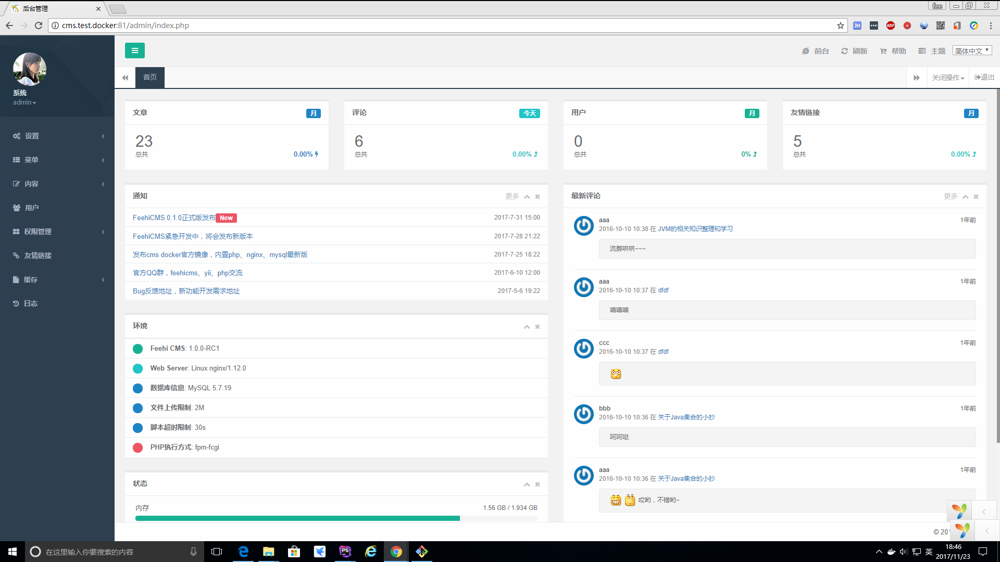
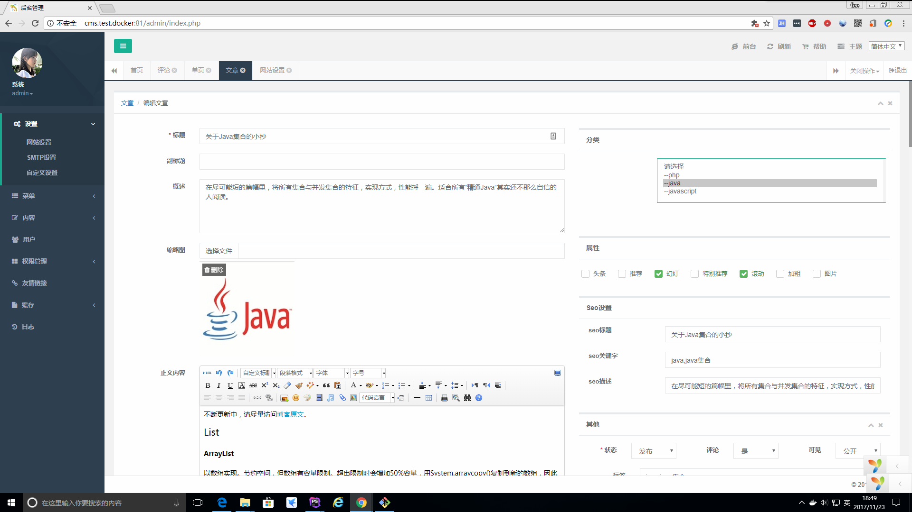
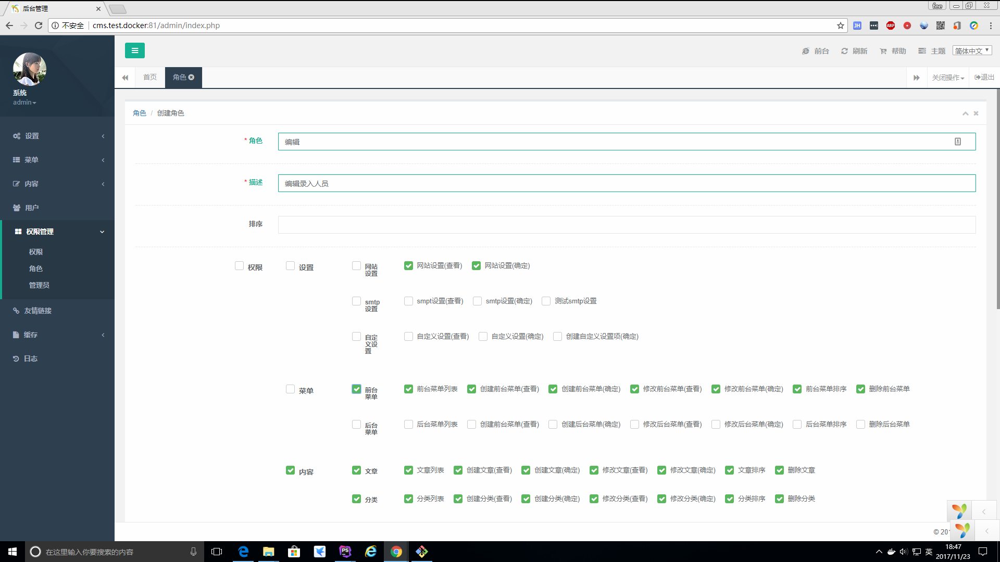
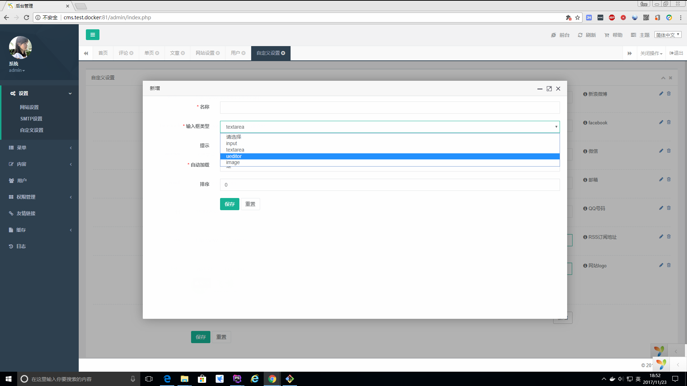
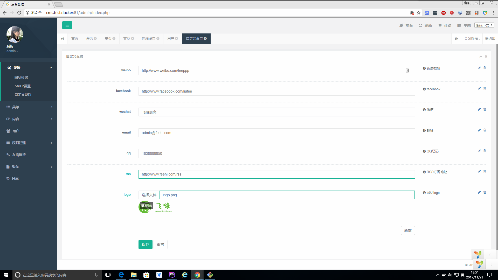

FeehiCMS  __[(English)](docs/README_EN.md)__  首款编写单元测试、功能测试、验收测试的yii2开源系统
===============================

基于yii2的CMS系统，运行环境与yii2(php>=5.4)一致。FeehiCMS旨在为yii2爱好者提供一个基础功能稳定完善的系统，使开发者更专注于业务功能开发。
FeehiCMS没有对yii2做任何的修改、封装，但是把yii2的一些优秀特性几乎都用在了FeehiCMS上，虽提供文档，
但FeehiCMS提倡简洁、快速上手，基于FeehiCMS开发可以无需文档，反倒FeehiCMS为yii2文档提供了最好的实例

[](https://packagist.org/packages/feehi/cms)
[](https://packagist.org/packages/feehi/cms)
[](https://www.travis-ci.org/liufee/cms)


更新记录
-------
2.0.2 增加cdn,使用layer弹窗替换swal,修复时间范围搜索需要按回车的bug

2.0.1 增加gii自动生成后台crud,优化后台排序,优化其他功能

2.0.0 修复bug,增加1.0.0系列alpha、beta、rc版所有的功能

1.0.0rc2 修复bug

1.0.0rc1 优化使用

1.0.0beta 3 修复bug

1.0.0beta2 增加自定义图片类型设置,优化管理员角色创建和修改

1.0.0beta1 修复bug

1.0.0alpha3 重写文章tag,修复两次model validate

1.0.0alpha2 修复bug 

1.0.0alpha1 增加restful api,单元测试,行为测试,验收测试,替换为yii2最新模板,优化composer安装依赖替换fxp/composer-asset-plugin为Asset Packagist,重写rbac权限管理替换为yii2内置实现

0.1.3 版本已经集成swoole作为FeehiCMS应用服务器，详细配置及使用参见[yii2-swoole](https://www.github.com/liufee/yii2-swoole)


帮助
---------------
1. 开发文档[http://doc.feehi.com](http://doc.feehi.com)

2. QQ群 258780872

3. 微信 <br> 

4. Email job@feehi.com

5. [bug反馈](http://www.github.com/liufee/cms/issues)


功能
---------------
 * 多语言
 * 单元测试
 * 功能测试
 * 验收测试
 * RBAC权限管理
 * restful api
 * 文章管理 
 * 操作日志
 
 FeehiCMS提供完备的web系统基础通用功能，包括前后台菜单管理,文章标签,广告,banner,缓存,网站设置,seo设置,邮件设置,分类管理,单页...
 
 
快速体验
----------------
1. 使用演示站点
演示站点后台   **用户名:feehicms 密码123456**
      * php7.0.0
        * 后台 [http://demo.cms.feehi.com/admin](http://demo.cms.feehi.com/admin)
        * 前台 [http://demo.cms.feehi.com](http://demo.cms.feehi.com/)
        * api [http://demo.cms.feehi.com/api/articles](http://demo.cms.feehi.com/api/articles)
      * swoole (docker)
        * swoole演示前台 [http://swoole.demo.cms.qq.feehi.com](http://swoole.demo.cms.qq.feehi.com)
        * swoole演示后台 [http://swoole-admin.demo.cms.qq.feehi.com](http://swoole-admin.demo.cms.qq.feehi.com)
      * php7.1.8 (docker)
        * 备用演示前台1 [http://demo.cms.qq.feehi.com](http://demo.cms.qq.feehi.com)
        * 备用演示后台1 [http://demo.cms.qq.feehi.com/admin](http://demo.cms.qq.feehi.com/admin)
        * 备用演示api1 [http://demo.cms.qq.feehi.com/api](http://demo.cms.qq.feehi.com/api/articles)

2. 使用Docker容器
    ```bash
    $ docker pull registry.cn-hangzhou.aliyuncs.com/liufee/cms
    $ docker run --name feehicms -h feehicms -itd -p 80:80 liufee/cms
    ```
 
 
安装
---------------
前置条件: 如未特别说明，本文档已默认您把php命令加入了环境变量，如果您未把php加入环境变量，请把以下命令中的php替换成/path/to/php
1. 使用归档文件(简单，适合没有yii2经验者)
    >使用此方式安装，后台超管用户名和密码会在安装过程中让您填入
    1. 下载FeehiCMS源码 [点击此处下载最新版](http://resource-1251086492.file.myqcloud.com/Feehi_CMS.zip)
    2. 解压到目录 
    3. 配置web服务器(参见下面)
    4. 浏览器打开 http://localhost/install.php 按照提示完成安装(若使用php内置web服务a器则地址为 http://localhost:8080/install.php )
    5. 完成
    
2. 使用composer (`推荐使用此方式安装`)
    >使用此方式安装，默认的后台超级管理员用户名admin密码123456
    
     >composer的安装以及国内镜像设置请点击 [此处](http://www.phpcomposer.com/)
     
     >以下命令默认您已全局安装composer，如果您是局部安装的composer:请使用php /path/to/composer.phar来替换以下命令中的composer
     
     1. 使用composer下载创建FeehiCMS项目
        **以下两个命令任选其一。如果喜欢简单且日后不需要升级FeehiCMS请选择命令一,如果日后需要平滑升级FeehiCMS请选择命令二**
        **2018.01.25备注:当前推荐使用命令一，命令二还有一些bug，遇到情况请反馈给我**
        
        ```bash
            $ composer create-project feehi/cms webApp //此命令创建的FeehiCMS项目不能平滑升级新版本(目录结构简单,目前主力维护版本)
        ```
        ```bash
            $ composer create-project feehi/feehicms webApp //此命令创建的FeehiCMS项目能够通过运行composer update平滑升级到FeehiCMS新版本(FeehiCMS以composer包提供,未来可能主力维护此版本)
        ```
     2. 依次执行以下命令初始化yii2框架以及导入数据库
         ```bash
         $ cd webApp
         $ php ./init --env=Development #初始化yii2框架，线上环境请使用--env=Production
         $ php ./yii migrate/up --interactive=0 #导入FeehiCMS sql数据库，执行此步骤之前请先到common/config/main-local.php修改成正确的数据库配置
         ```
     3. 配置web服务器(参加下面)
     4. 完成
 
附:web服务器配置(注意是设置"path/to/frontend/web为根目录)
 
 * php内置web服务器(仅可用于开发环境,当您的环境中没有web服务器时)
 ```bash
  cd /path/to/cms
  php ./yii serve  
  
  #至此启动成功，可以通过localhost:8080/和localhost:8080/admin来访问了，在线安装即访问localhost:8080/install.php
 ```
 
 * Apache
 ```bash
  DocumentRoot "path/to/frontend/web"
  <Directory "path/to/frontend/web">
      # 开启 mod_rewrite 用于美化 URL 功能的支持（译注：对应 pretty URL 选项）
      RewriteEngine on
      # 如果请求的是真实存在的文件或目录，直接访问
      RewriteCond %{REQUEST_FILENAME} !-f
      RewriteCond %{REQUEST_FILENAME} !-d
      # 如果请求的不是真实文件或目录，分发请求至 index.php
      RewriteRule . index.php
  
      # ...其它设置...
  </Directory>
  ```
  
 * Nginx
 ```bash
 server {
     server_name  localhost;
     root   /path/to/frontend/web;
     index  index.php index.html index.htm;
     try_files $uri $uri/ /index.php?$args;
     
     location ~ /api/(?!index.php).*$ {
        rewrite /api/(.*) /api/index.php?r=$1 last;
     }
 
     location ~ \.php$ {
         fastcgi_pass   127.0.0.1:9000;
         fastcgi_index  index.php;
         fastcgi_param  SCRIPT_FILENAME  $document_root$fastcgi_script_name;
         include        fastcgi_params;
     }
 }
 ```
 
 
运行测试
-------
1. 仅运行单元测试,功能测试(不需要配置web服务器)
 ```bash
    cd /path/to/webApp
    vendor/bin/codecept run
 ```
2. 运行单元测试,功能测试,验收测试(需要配置完web服务器)
    1. 分别拷贝backend,frontend,api三个目录下的tests/acceptance.suite.yml.example到各自目录，并均重名为acceptance.suite.yml,且均修改里面的url为各自的访问url地址
    2. 与上(仅运行单元测试,功能测试)命令一致


项目展示
------------
* [选校通](https://www.xuanxt.com/)   
* [微信公众号益乐游戏](http://www.ylegame.com/)  
* [Usens Dev博客](http://dev.usensinc.com/)  
* [最美容颜](http://www.zmface.com/)  
* [云上旅游集团](http://www.ys517.cn/)  
* [微信公众号蚂蚁鲜生](http://www.chijidun.com/) 
*  ......


运行效果
---------












特别鸣谢
---------
[twitf](https://github.com/twitf) 在后台时间搜索范围提供的建议和代码片段